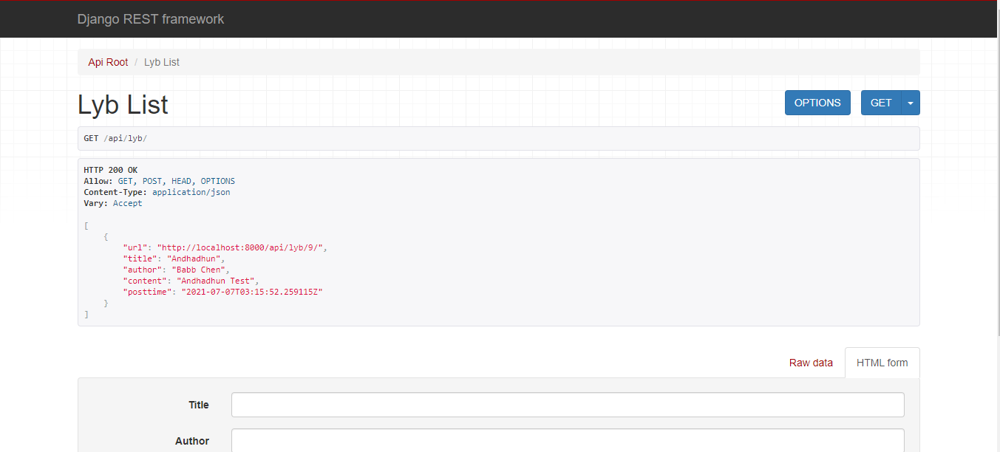
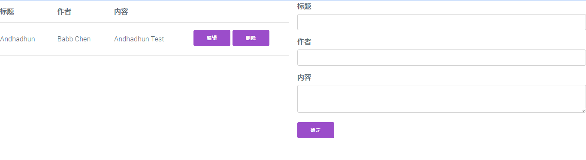

## backends

### django

1. pip install django
2. django-admin startproject backends
3. cd backends
4. python manage.py startapp lyb
5. backends/settings.py INSTALLED_APPS add lyb

```python
INSTALLED_APPS = [
    ...
    'lyb'
    ...
]
```

6. python manage.py runserver

#### models

1. lyb/models.py

```python
from django.db import models

class Lyb(models.Model):
    title = models.CharField(max_length=100)
    author = models.CharField(max_length=50)
    content = models.TextField()
    posttime = models.DateTimeField(auto_now_add=True)

    class Meta:
        db_table = "d_lyb"
```

2. python manage.py makemigrations
3. python manage.py migrate

### djangorestframework

[Quickstart - Django REST framework](https://www.django-rest-framework.org/tutorial/quickstart/#quickstart)

1. pip install djangorestframework
2. backends/settings.py INSTALLED_APPS add rest_framework

```python
INSTALLED_APPS = [
    ...
    'rest_framework'
    ...
]
```

#### serializer

lyb/serializers.py

```python
from rest_framework import serializers
from .models import Lyb


class LybSerializer(serializers.HyperlinkedModelSerializer):
    class Meta:
        model = Lyb
        fields = "__all__"
```

#### viewset

lyb/views.py

```python
from django.shortcuts import render
from rest_framework import viewsets
from .models import Lyb
from .serializers import LybSerializer

class LybViewSet(viewsets.ModelViewSet):
    queryset = Lyb.objects.all().order_by('-posttime')
    serializer_class = LybSerializer
```

#### router

backends/urls.py

```python
from django.contrib import admin
from django.urls import path, include
from rest_framework import routers
from lyb.views import LybViewSet

router = routers.DefaultRouter()
router.register(r'lyb', LybViewSet)

urlpatterns = [
    path('admin/', admin.site.urls),
    path('api/', include(router.urls))
]
```

#### djangorestframework interface

python manage.py runserver

http://localhost:8000/api/lyb



### django-cors-headers

1. pip install django-cors-headers
2. backends/settings.py INSTALLED_APPS add corsheaders

```python
INSTALLED_APPS = [
    ...
    'corsheaders',
    ...
]
```

2. backends/settings.py MIDDLEWARE add corsheaders.middleware.CorsMiddleware

```python
MIDDLEWARE = [
...
'corsheaders.middleware.CorsMiddleware',
...
]
```

3. backends/settings.py setting allow cors

```python
CORS_ALLOW_ALL_ORIGINS = True
```

## frontends

### vite-app

1. npm init vite-app frontends
2. cd frontends
3. npm install & npm install axios
4. npm run dev
5. index.html add milligram CDN link

[Milligram - A minimalist CSS framework](https://milligram.io/)

```html
<link
    rel="stylesheet"
    href="https://fonts.googleapis.com/css?family=Roboto:300,300italic,700,700italic"
/>
<link
    rel="stylesheet"
    href="https://cdnjs.cloudflare.com/ajax/libs/normalize/8.0.1/normalize.css"
/>
<link
    rel="stylesheet"
    href="https://cdnjs.cloudflare.com/ajax/libs/milligram/1.4.1/milligram.css"
/>
```

6. components/Lyb.vue

```html
<template>
    <div class="row">
        <div class="column">
            <table>
                <thead>
                    <tr>
                        <th>标题</th>
                        <th>作者</th>
                        <th>内容</th>
                        <th></th>
                    </tr>
                </thead>
                <tbody>
                    <tr v-for="item in ly_list" :key="item.url">
                        <td>{{ item.title }}</td>
                        <td>{{ item.author }}</td>
                        <td>{{ item.content }}</td>
                        <td>
                            <button
                                @click="editLyb(item)"
                                style="margin: 0.5rem"
                            >
                                编辑
                            </button>
                            <button @click="deleteLyb(item)">删除</button>
                        </td>
                    </tr>
                </tbody>
            </table>
        </div>
        <div class="column">
            <input type="hidden" v-model="lyb.url" />
            <div>
                <label for="title">标题</label
                ><input type="text" id="title" v-model="lyb.title" />
            </div>
            <div>
                <label for="author">作者</label
                ><input type="text" id="author" v-model="lyb.author" />
            </div>
            <div>
                <label for="content">内容</label
                ><textarea id="content" v-model="lyb.content"></textarea>
            </div>
            <button @click="saveLyb">确定</button>
        </div>
    </div>
</template>

<script>
    import axios from "axios";
    import { reactive, onMounted, toRefs } from "vue";

    export default {
        name: "Lyb",
        setup() {
            let base_url = "http://localhost:8000/api/lyb/";

            const lyb_blank = { url: "", title: "", author: "", content: "" };

            const state = reactive({
                ly_list: [],
                lyb: Object.assign({}, lyb_blank),
            });

            const getLyb = () => {
                axios
                    .get(base_url)
                    .then((res) => {
                        state.ly_list = res.data;
                        state.lyb = Object.assign({}, lyb_blank);
                    })
                    .catch((err) => {
                        console.log(err);
                    });
            };

            const editLyb = (item) => {
                state.lyb.url = item.url;
                state.lyb.title = item.title;
                state.lyb.author = item.author;
                state.lyb.content = item.content;
            };

            const deleteLyb = (item) => {
                axios
                    .delete(item.url)
                    .then(() => {
                        getLyb();
                    })
                    .catch((err) => {
                        console.log(err);
                    });
            };

            const saveLyb = () => {
                let newLyb = {
                    title: state.lyb.title,
                    author: state.lyb.author,
                    content: state.lyb.content,
                };

                if (!state.lyb.url) {
                    // add
                    axios
                        .post(base_url, newLyb)
                        .then(() => {
                            getLyb();
                        })
                        .catch((err) => {
                            console.log(err);
                        });
                } else {
                    // update
                    axios
                        .put(state.lyb.url, newLyb)
                        .then(() => {
                            getLyb();
                        })
                        .catch((err) => {
                            console.log(err);
                        });
                }
            };

            onMounted(() => {
                getLyb();
            });

            return {
                ...toRefs(state),
                editLyb,
                saveLyb,
                deleteLyb,
            };
        },
    };
</script>
```

7. npm run dev

http://localhost:3000/


